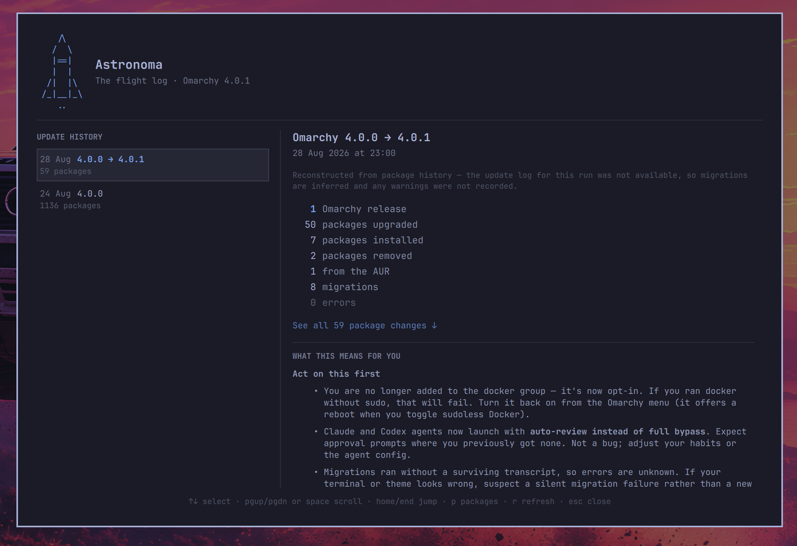

# Astronoma

```
   /\
  /  \
  |==|      Omarchy is a rocket ship.
  |  |      Astronoma is the flight log.
 /|  |\
/_|__|_\
   ..
```

Omarchy moves fast. Astronoma keeps track of what each update actually did
to *this* machine — the version it moved you to, the releases you crossed,
the packages it added, upgraded and removed, the migrations that ran, and
anything that went wrong — and keeps that record long after
`/tmp/omarchy-update.log` is gone.

It optimises for one question:

> I just updated Omarchy. What changed, and does any of it matter to me?



The QML is deliberately thin. A bundled `astronoma` helper does all the
reading, parsing, persistence and fetching, and prints JSON;
`BarWidget.qml` draws the bar rocket and its summary card, `Flightlog.qml`
draws the full view, and both simply render what the helper returns.

## Features

- **A bar rocket** that appears when an update has landed that you have not
  read yet, and stands down once you have. Click for a card with the
  version change, what the update did, and the headline changes from the
  releases you crossed.
- **A full flight log** — every captured update, the releases crossed with
  their notes rendered natively, migrations, warnings, errors, and a
  package breakdown.
- **Update history that survives reboots.** The `/tmp` transcript is gone
  after a restart, so parsed records are kept in
  `~/.local/state/omarchy-updates/`.
- **Retroactive history.** On first run Astronoma reconstructs the updates
  it can still evidence from package history, so it is useful immediately
  rather than after your next update.
- **A package drill-down** — Upgraded / Installed / Removed, plus an AUR
  lens over the same update, each showing `name  old → new`, with a filter
  for updates that moved a thousand packages.
- **Errors and warnings surfaced**, never silently dropped.
- **An optional agent summary.** If Claude Code or Codex is installed,
  Astronoma can hand it the release notes plus your
  machine's package changes and ask what actually affects you.
- **Offline-safe.** Release notes are cached; a failed refresh shows the
  cached copy and says so.

Everything except the summary works with no agent, no API key, and no
network.

## Install

```bash
omarchy plugin add https://github.com/JohnJKerr/omarchy-astronoma.git
omarchy plugin enable io.github.johnjkerr.astronoma
```

Plugins land disabled so you can read the code before running it — it runs
unsandboxed inside `omarchy-shell`. Add `--enable --yes` to skip both
prompts.

Astronoma needs `python3`, which Omarchy already installs. Nothing else.

Agent summaries remain disabled by default. To pre-accept them during a
scripted setup, enable consent immediately after installation:

```bash
~/.config/omarchy/plugins/io.github.johnjkerr.astronoma/bin/astronoma agent-summaries enable
```

Optionally add a permanent row to the Omarchy menu under **Update →
Changelog**:

```bash
~/.config/omarchy/plugins/io.github.johnjkerr.astronoma/bin/astronoma-menu-entry add
```

Updating is an ordinary plugin command:

```bash
omarchy plugin update io.github.johnjkerr.astronoma
```

To remove it, run `uninstall.sh`. It takes out the optional menu row before
the plugin directory that row points at, which `omarchy plugin remove` on its
own cannot do:

```bash
~/.config/omarchy/plugins/io.github.johnjkerr.astronoma/uninstall.sh
# or, from a checkout:
./uninstall.sh --purge    # also delete captured history and the release cache
```

### From a checkout

To hack on it, clone anywhere and install a copy:

```bash
git clone https://github.com/JohnJKerr/omarchy-astronoma.git
cd omarchy-astronoma
./install.sh --menu --enable-agent-summaries
```

Omit `--enable-agent-summaries` to keep the default in-product consent flow.

`install.sh` copies rather than symlinks on purpose: a symlinked plugin
directory does not hot-reload, and the shell will keep running stale QML.

## Opening it

On the default `unread` visibility the rocket leaves the bar once you have
read an update. The flight log is still loaded and reachable:

- **Omarchy menu** — Update → Changelog, if you added the row above.
- **A keybinding** in `~/.config/hypr/bindings.lua`:

  ```lua
  o.bind("SUPER + SHIFT + U", "Changelog", "omarchy-shell shell toggle io.github.johnjkerr.astronoma '{}'")
  ```

- **A terminal** — `omarchy-shell shell toggle io.github.johnjkerr.astronoma '{}'`.
- Or keep the rocket in the bar permanently with `visibility: "always"`.

## Interactions

- **Bar icon**: left = summary card, right = full flight log, middle =
  refresh.
- **Card**: `f` opens the flight log, `r` refreshes, Esc closes.
- **Flight log**: `↑`/`↓` or `j`/`k` move through history, `p` jumps to the
  package breakdown, `r` refreshes, Esc closes.
- **IPC**: `omarchy-shell astronoma <open|close|toggle|refresh>` for the
  flight log, `omarchy-shell astronoma.bar <open|close|toggle|refresh|status>`
  for the card. These targets are why the manifest sets `keepLoaded`: a
  plugin that is only built on demand has no IPC handler registered until
  something has already opened it, which is the wrong way round for a
  keybinding.

Summarising has no keyboard shortcut on purpose. The flight log takes
exclusive keyboard focus, and a summary costs a real agent run, so the
button is the only way to start one.

## Settings

Settings live on the widget's entry in `~/.config/omarchy/shell.json` and
can be set with `omarchy bar set io.github.johnjkerr.astronoma <key> <value>`:

| Key | Default | What it does |
|---|---|---|
| `visibility` | `"unread"` | `"unread"` shows the rocket only while an update you have not opened is waiting; `"always"` keeps it in the bar |
| `refreshIntervalSec` | `900` | How often the widget re-reads local update state. The network refresh happens when you open the card, not on this timer |

```bash
omarchy bar set io.github.johnjkerr.astronoma visibility always
omarchy bar set io.github.johnjkerr.astronoma refreshIntervalSec 300 --json
```

Numbers need `--json`, or they land in `shell.json` as strings.

Astronoma writes only to `~/.local/state/omarchy-updates/` (update records,
agent summaries, and which update you have read) and `~/.cache/astronoma/`
(the release cache). Removing the plugin leaves both, so your history
survives a reinstall; `uninstall.sh --purge` deletes them. Machine-specific
state and summaries are stored with user-only permissions.

Agent summaries are opt-in and run only when you press the summary button.
They are disabled by default. The first press shows what data will be sent;
a second, explicit **Enable and summarise** press records consent and starts
the agent. No configuration-file editing is required. Revoke consent with
`bin/astronoma agent-summaries disable`.
Release notes and local update evidence are treated as untrusted input, and
are passed to the agent inside a quoted block whose delimiter the quoted text
cannot close. Claude Code is launched with tools disabled. Codex runs
ephemerally with its shell, hooks, plugins, browser, apps, skills, image
tools, user configuration, and web search disabled; strict configuration
validation makes unsupported controls fail closed. Both run from an empty
temporary directory, which keeps project instruction files out of reach.

Astronoma deliberately does not invoke general-purpose agents that cannot
guarantee a non-tooling run. Gemini CLI is **not** supported for this reason:
its non-interactive mode only gates the tools that ask for approval, while
read-only ones — `web_fetch` and `google_web_search` among them — run
unprompted, which is a network path out of text this feature treats as
untrusted. Current releases deprecate `--allowed-tools` in favour of a policy
engine whose rule format is not documented outside the bundle. It will be
supported again when there is a verifiable way to start it with no tools.

## Data

| Source | What it provides |
|---|---|
| `/var/log/pacman.log` | Exactly which packages changed, and when. World-readable and survives reboots, so it is what Astronoma groups into updates. |
| `/tmp/omarchy-update.log` | Migrations, warnings and errors — what only the update transcript records. Cleared on reboot. It is a predictable path in a world-writable directory, so its contents are treated as untrusted: they are displayed as plain text and quoted, never interpreted. |
| `~/.local/state/omarchy/migrations/` | Which migrations ran, recovered from marker mtimes when the transcript is gone. |
| GitHub releases | Omarchy's user-facing release notes, cached locally. |

pacman's log has no notion of "an update", so Astronoma groups transactions
that run back to back into one — which is what an Omarchy update looks like
from the log's point of view. The transcript is matched to the update it
dates to by its mtime.

Updates captured before Astronoma was installed are reconstructed from
package history alone. They are labelled **partial** in the UI, because
their migrations are inferred and their warnings were never recorded.

Astronoma never changes packages. It is an update *explainer*, not a
package manager.

## The CLI

The plugin is a presentation layer over a helper you can run yourself.
Every operational command prints JSON (`--version` and usage errors are plain text).

```bash
bin/astronoma report          # everything the plugin renders
bin/astronoma capture         # parse logs into update history
bin/astronoma history         # captured updates, newest first
bin/astronoma show <id>       # one update in full
bin/astronoma releases        # Omarchy releases (--refresh to fetch)
bin/astronoma agents          # which agent CLIs are installed
bin/astronoma agent-summaries # consent status; add enable or disable
bin/astronoma summarise [id]  # impact summary via an installed agent
bin/astronoma seen [id]       # mark an update as read
```

Add `--pretty` to any of them.

## Development

```bash
python3 -m unittest discover -s tests -t .   # 64 tests, no dependencies
omarchy plugin validate .                    # manifest against the schema
qmllint -I "$OMARCHY_PATH/shell" ./*.qml       # needs qt6-declarative
./install.sh && omarchy-restart-shell        # install and reload
```

Adding support for another agent CLI is one entry in `AGENTS` in
`helper/astronoma/agent.py`.

## Licence

MIT. See [LICENSE](LICENSE).
